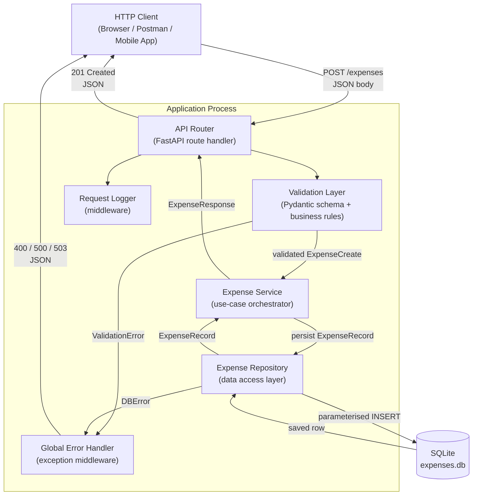

# Architecture Document: Expense Tracker — US-001 Add Expense

## 1. Overview
- **Source**: `docs/requirements.md`
- **Status**: Draft
- **Last Updated**: 10 Aug 2026
- **Owners**: Sriram Dhanaraj
- **Architecture Style**: Layered Modular Monolith

---

## 2. Context and Drivers

### Business and Product Drivers

The primary goal of US-001 is to give a user a reliable, single-step mechanism to record a new spending event with an amount, category, date, and optional description. Every expense saved must carry a system-generated unique identifier so that future features (editing, deletion, listing) can reference individual records unambiguously. The MVP must be delivered quickly by a single developer with no cloud or compliance constraints, so simplicity and correctness are the dominant priorities over operational scale.

### Architectural Drivers

| Driver | Requirement Source | Implication |
|---|---|---|
| Sub-500 ms response time at 50 concurrent requests | NFR-001 | Synchronous request handling is acceptable; no async queue needed at this scale |
| Input validation isolated from routing and persistence | NFR-005 | Dedicated validation layer; not inline in the route handler |
| Atomic writes — no partial records on failure | NFR-002 | Single SQLite write per request inside a transaction |
| 503 on transient data-store errors | NFR-003 | Repository layer must translate DB exceptions to typed error signals |
| Request logging + WARN/ERROR log levels | NFR-008 | Structured middleware-level logging; not ad-hoc print statements |
| RESTful API with consistent JSON error shape | NFR-006 | Centralised error handler; all responses share one schema |
| Injection prevention and max body size | NFR-004 | Parameterised SQL; FastAPI body-size limit |
| No authentication for MVP | A-04 | No auth middleware for now; interface designed to add it later |

---

## 3. High-Level Architecture Recommendation

### Recommended Approach

A **Layered Modular Monolith** deployed as a single Python process using FastAPI. The application is divided into four explicit, vertically stacked layers: API (routing), Validation, Service (use-case orchestration), and Repository (data access). Each layer has a single, well-defined responsibility and communicates only with the layer directly below it. The data store is a local SQLite file accessed via Python's built-in `sqlite3` module.

This approach was chosen because:

- The workload is a single endpoint with straightforward CRUD semantics; distributing it across services would add infrastructure overhead with no benefit.
- FastAPI's Pydantic integration handles structural type validation automatically, leaving only business-rule validation to the custom validation layer.
- SQLite requires zero infrastructure setup and satisfies the persistence and data-integrity requirements for a local, single-developer project.
- The layered boundary explicitly satisfies NFR-005 (validation isolated from routing and persistence) and keeps each concern independently testable.

### Alternatives Considered

- **Option A: Flask + SQLAlchemy** — A viable Python alternative. Flask is more flexible but provides no built-in request validation or automatic OpenAPI documentation. SQLAlchemy adds ORM convenience but is heavier than direct `sqlite3` for a single-table MVP. *Rejected*: FastAPI's Pydantic validation reduces boilerplate and aligns better with the requirement to enforce field types and constraints at the framework boundary.

- **Option B: Microservices (separate validation service + storage service)** — Each concern runs as an independent deployable. This maximises independent scalability. *Rejected*: The scale target (50 concurrent requests, single developer, local deployment) does not justify the network overhead, inter-service contracts, and operational complexity. Microservices remain a viable future evolution once the feature set expands.

---

## 4. Component Diagram

---

## 5. Key Components and Responsibilities

### Component 1: API Router (FastAPI route handler)

- **Responsibility**: Declare the `POST /expenses` endpoint, parse the incoming JSON request body into a typed input model, delegate work to the Validation and Service layers, and serialise the response. Sets the maximum allowed request body size.
- **Interfaces**: Exposes `POST /expenses`. Accepts `Content-Type: application/json`. Returns `201 Created` with a JSON expense object on success, or a structured JSON error on failure.
- **Data Owned**: None. The router does not retain state; it only transforms and delegates.
- **Scaling Considerations**: FastAPI is ASGI-compatible. If concurrency needs grow beyond the synchronous SQLite limit, the router can be switched to async handlers and an async DB driver without changing the layer contract.

### Component 2: Validation Layer (Pydantic schema + business rules)

- **Responsibility**: Enforce all field-level and business-rule constraints defined in FR-005 through FR-007 and the error-handling table in Section 8 of the requirements. This layer is the single location where input is judged valid or invalid.
  - Structural validation (type coercion, required-field presence) is handled by a Pydantic `BaseModel`.
  - Business rules (amount > 0, category not blank or whitespace, date matches `YYYY-MM-DD`) are enforced via Pydantic field validators.
- **Interfaces**: Receives raw request data from the router; raises `ValidationError` on failure; returns a typed `ExpenseCreate` value object on success.
- **Data Owned**: None. Stateless; no persistence.
- **Scaling Considerations**: Stateless — scales horizontally without coordination.

### Component 3: Expense Service (use-case orchestrator)

- **Responsibility**: Implement the single use case "record a new expense". Generates a UUID v4 identifier (FR-002), constructs the full `ExpenseRecord`, and calls the repository to persist it (FR-003). Returns the persisted record to the router (FR-004).
- **Interfaces**: Accepts `ExpenseCreate`; returns `ExpenseRecord`. Raises a typed `PersistenceError` if the repository signals a failure.
- **Data Owned**: None directly; orchestrates data between layers.
- **Scaling Considerations**: Stateless — scales horizontally without coordination.

### Component 4: Expense Repository (data access layer)

- **Responsibility**: Execute all SQLite interactions for expense records. Wraps every write in a transaction to satisfy the atomicity requirement (NFR-002). Catches `sqlite3` exceptions and re-raises them as typed `DBError` or `DBUnavailableError` so the layers above can map them to the correct HTTP status codes (500 vs 503).
- **Interfaces**: Accepts `ExpenseRecord`; returns the persisted `ExpenseRecord`. Exposes `insert(record: ExpenseRecord) -> ExpenseRecord`.
- **Data Owned**: The `expenses` table in `expenses.db` (SQLite file on disk).
- **Scaling Considerations**: SQLite supports a single writer at a time. At 50 concurrent requests this is acceptable. If write throughput grows, the repository interface is the isolation point for swapping to PostgreSQL without changing the service or router.

### Component 5: Request Logger (middleware)

- **Responsibility**: Log every inbound request and its outcome with timestamp, HTTP method, endpoint path, response status code, and latency (NFR-008). Log validation failures at `WARN` level and unhandled exceptions at `ERROR` level with stack trace.
- **Interfaces**: FastAPI middleware; wraps every request/response cycle transparently.
- **Data Owned**: None. Writes to stdout / log file only.
- **Scaling Considerations**: Stateless — no impact on horizontal scaling.

### Component 6: Global Error Handler (exception middleware)

- **Responsibility**: Catch `ValidationError`, `PersistenceError`, and unhandled exceptions and translate them into the standard JSON error envelope `{"error": "...", "details": [...]}` with the correct HTTP status code (400, 500, 503).
- **Interfaces**: FastAPI exception handler registered globally; intercepts exceptions before they propagate to the client.
- **Data Owned**: None.
- **Scaling Considerations**: Stateless.

---

## 6. Data Flow

### Core Flow 1: Record a New Expense (Happy Path)

1. The HTTP client sends `POST /expenses` with a JSON body containing `amount`, `category`, `date`, and optional `description`.
2. FastAPI's Request Logger middleware records the inbound request (timestamp, method, path).
3. FastAPI deserialises the JSON body into the Pydantic `ExpenseCreate` schema. Structural type errors (e.g., non-numeric amount) are caught here and passed to the Global Error Handler → 400 response.
4. The Validation Layer's field validators run: amount > 0, category not blank, date matches `YYYY-MM-DD`. Any violation raises `ValidationError` → Global Error Handler → 400 response.
5. The validated `ExpenseCreate` is passed to the Expense Service.
6. The Expense Service generates a UUID v4 identifier and constructs an `ExpenseRecord`.
7. The Expense Repository opens a SQLite transaction and executes a parameterised `INSERT INTO expenses ...`. On success the transaction is committed.
8. If the INSERT fails transiently, the repository raises `DBUnavailableError` → Global Error Handler → 503 response, no partial record saved.
9. The persisted `ExpenseRecord` is returned up through the Service to the Router.
10. The Router serialises the record as JSON and returns `201 Created`.
11. The Request Logger middleware records the response status and latency.

### Core Flow 2: Record a New Expense (Validation Failure)

1. Client submits a request with an invalid field (e.g., `amount: -5`).
2. Steps 1–3 above execute normally.
3. At Step 4 the Validation Layer raises `ValidationError` with message `"amount must be greater than zero"`.
4. The Global Error Handler catches the exception, constructs `{"error": "Validation failed", "details": ["amount must be greater than zero"]}`, and returns `400 Bad Request`.
5. The Request Logger records the 400 response at `WARN` level.
6. No record is written to the database.

### Data Stores and Movement

- **Source Data**: JSON request body submitted by the HTTP client.
- **Processing**: Pydantic coercion (structural) then field validators (business rules) transform and verify the raw payload into a typed `ExpenseCreate` value object. The Service adds the system-generated UUID to produce an `ExpenseRecord`.
- **Persistence**: The `ExpenseRecord` is written to the `expenses` table in `expenses.db` (local SQLite file). The schema mirrors the data model in Section 7 of the requirements. Records are retained indefinitely (NFR-009).
- **Consumption**: The persisted record is read back from the repository and returned to the caller as the `201 Created` response body. No downstream consumers exist in the MVP scope.

---

## 7. Technology Choices

- **Frontend**: N/A — the MVP exposes an HTTP API only. Any HTTP client (browser, Postman, mobile app) satisfies NFR-007.

- **Backend**: **Python 3.11+ with FastAPI 0.110+**. FastAPI was chosen because it provides automatic request body parsing and serialisation via Pydantic, built-in OpenAPI documentation (useful for manual testing), ASGI compatibility for future async scale-out, and concise route declaration. It directly satisfies the layered validation requirement (NFR-005) by treating Pydantic models as the validation contract. Python's `uuid` standard library handles UUID v4 generation (FR-002) with no additional dependency.

- **Data Layer**: **SQLite via Python's built-in `sqlite3` module**. SQLite requires no separate server process, no installation, and no configuration, which is appropriate for a local single-developer deployment. Parameterised queries prevent SQL injection (NFR-004). The `sqlite3` module supports transactions for atomic writes (NFR-002). If write concurrency requirements grow, the repository abstraction isolates the migration path to PostgreSQL.

- **Infrastructure**: **Local / on-premises**. The application runs as a single Python process started with `uvicorn`. No container, cloud service, or reverse proxy is required for the MVP. The process can be wrapped in a simple shell script or systemd unit for the 99.9% uptime target (NFR-003).

- **Observability**: **Python `logging` module with structured output**. A FastAPI middleware component logs every request/response cycle (timestamp, method, path, status, latency). `WARN` level for validation failures; `ERROR` with traceback for unhandled exceptions. This satisfies NFR-008 without an external logging platform for the MVP.

- **Security Controls**: No authentication or authorisation for the MVP (A-04, NFR-004). Input sanitisation is handled through Pydantic validation and parameterised SQL. FastAPI's built-in body size limit is configured to prevent payload-flooding (NFR-004). HTTPS is an infrastructure concern and is out of scope for the application layer (A-07).

---

## 8. Cross-Cutting Concerns

- **Security**: Pydantic schemas enforce strict types, preventing injection at the deserialization boundary. All database interactions use parameterised queries, eliminating SQL injection risk. A maximum request body size is configured on the FastAPI application instance to prevent payload-flooding. No credentials, tokens, or PII are handled in this feature. Authentication is deferred to a post-MVP iteration.

- **Reliability and Resilience**: The Expense Repository wraps every write in a SQLite transaction. On any exception during the INSERT, the transaction is rolled back before the error is propagated — no partial record is ever saved (NFR-002). Repository exceptions are typed (`DBError`, `DBUnavailableError`) so the Global Error Handler can return `500` or `503` without exposing internal stack traces to callers (NFR-003). The application process should be managed by a process supervisor (e.g., systemd or a shell wrapper with restart-on-failure) to target 99.9% uptime.

- **Performance**: FastAPI with `uvicorn` handles 50 concurrent requests comfortably within a single synchronous worker given the lightweight SQLite write path. The target response time of 500 ms (NFR-001) is achievable at this scale. No caching layer is needed at MVP. If write throughput grows, uvicorn's multiple-worker mode or an async SQLite driver can be introduced without changing the layer contracts.

- **Scalability**: The application is designed to be stateless above the repository layer. The SQLite file is the only shared state and is the concurrency bottleneck. For the MVP's single-user, local deployment this is acceptable. Horizontal scale-out (multiple processes or machines) would require migrating the data layer to a networked database such as PostgreSQL; the repository interface isolates this change.

- **Maintainability**: Business validation logic is isolated in the Validation Layer (NFR-005); adding new rules requires changes in one place only. The four-layer structure (Router, Validation, Service, Repository) means each layer can be tested in isolation with mocks. Code must pass linting (e.g., `flake8` or `ruff`) and type-checking (`mypy`) as required by NFR-005.

- **Operational Readiness**: For the MVP, `uvicorn` is started directly (e.g., `uvicorn app.main:app --host 0.0.0.0 --port 8000`). Logs are written to stdout and can be redirected to a file. The SQLite database file path is configurable via an environment variable so it can be pointed at a different location without code changes. A health-check endpoint (`GET /health`) should be added alongside this feature to enable process-supervisor liveness monitoring, though it is out of scope for US-001.

---

## 9. Risks, Assumptions, and Open Questions

### Risks

- **R-01 — SQLite write concurrency ceiling**: SQLite serialises writes; under sustained high concurrency (beyond ~50 concurrent writers) response times will degrade. *Mitigation*: The repository layer is the only place that references SQLite; switching to PostgreSQL requires changing only the repository implementation. Monitor latency under load and plan the migration before onboarding multiple concurrent users.

- **R-02 — SQLite file durability on crash**: An OS crash mid-write could leave the WAL in an unrecovered state. *Mitigation*: Enable WAL mode (`PRAGMA journal_mode=WAL`) in the repository initialisation to reduce this window. For production use, add a regular backup of `expenses.db`.

- **R-03 — No authentication in MVP**: The endpoint is open to any caller on the network. *Mitigation*: Ensure the server is only reachable on localhost or a trusted private network for the MVP. API key or token authentication must be added before any public-facing deployment.

- **R-04 — uvicorn single-process availability**: A single `uvicorn` process has no automatic restart on crash. *Mitigation*: Wrap the process in a systemd unit or supervisor with `Restart=always` to approach the 99.9% uptime target (NFR-003).

### Assumptions

- A-01 through A-07 from `docs/requirements.md` are all carried forward unchanged.
- The application runs on a machine with Python 3.11 or later installed.
- The SQLite database file is stored on a local disk with sufficient write permissions for the running process.
- A single `expenses.db` file is shared by all requests; no multi-tenancy is required at this stage.
- `uvicorn` is available in the project's virtual environment as the ASGI server.

### Open Questions

- **OQ-01**: Should the SQLite database path be hard-coded (e.g., `./expenses.db`) or read from an environment variable? Recommended: environment variable with a sensible default — resolve before implementation begins.
- **OQ-02**: Is a `GET /health` liveness endpoint required alongside US-001, or deferred to a separate story? This affects the operational readiness of process-supervisor integration.
- **OQ-03**: Should decimal precision for `amount` be enforced at the SQLite column level (using `REAL` vs `TEXT` storage) or only at the application layer? Recommended: store as `REAL` and validate two decimal places in the Validation Layer.

---

## 10. Approval
- **Decision**: Pending
- **Approved By**: —
- **Approval Date**: —
